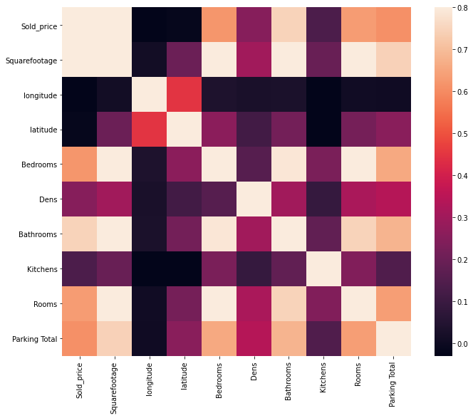
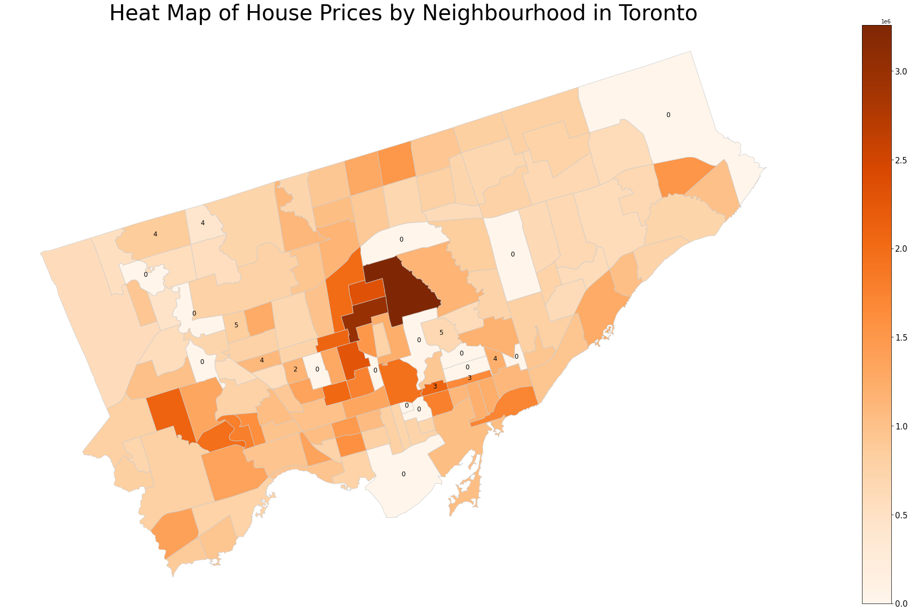
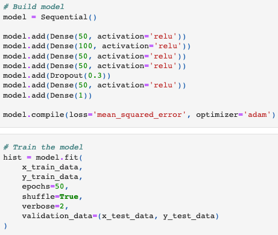
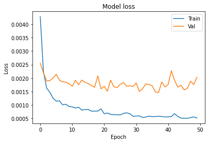

# Toronto-housing-prices-estimator

# Introduction
The purpose of this project is to predict the current value of unlisted properties in the Toronto region based on a 30+ variable multilayer percepitron. The intention is then to visualize this on a web-application like a Python-Flask with react flask where you would be able to type in an address or postal code, and our pre-trained model would spit out a value.

# Data
The data for this project was retrieved using a Puppeteer webscrapper taking data primarily from zolo.com with over 14,000 properties in data pulled and which will be stored in a MySQL database. The geolocational data was then found by using a latlong.net where the Puppeteer scrapper simulates human behavior to the long, lat data.
### Features
There were a variety of features as mentioned taken into consideration for the ML model:
- location
- type of property
- nearby amenities (i.e. nearest distance to schools, grocery stores etc.)
- Rankings of nearest schools
### Correlation Matrix of Features

### Location Data by Region

# NN Archetecture

# Results

